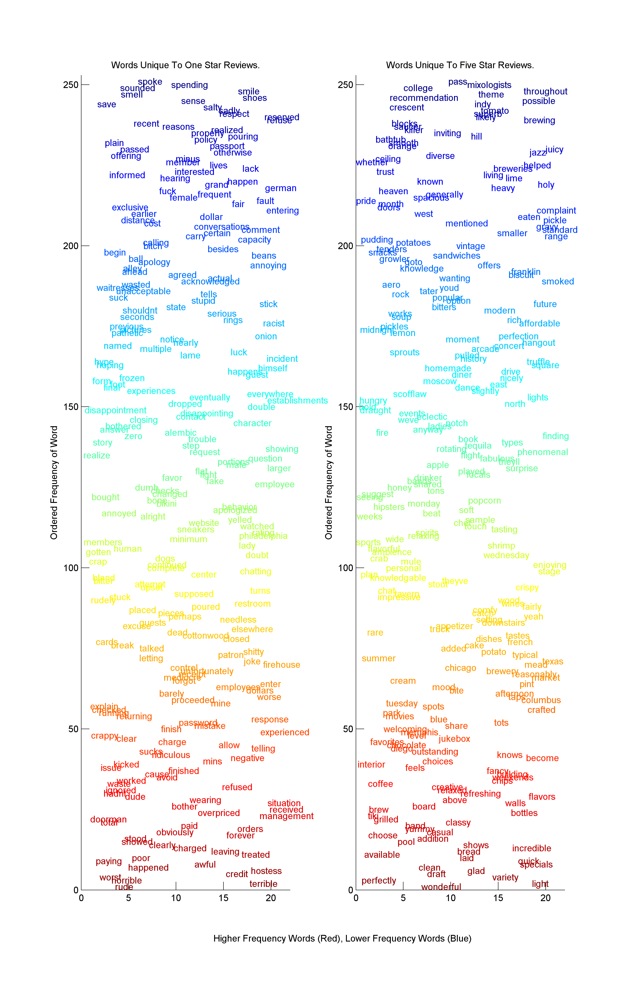
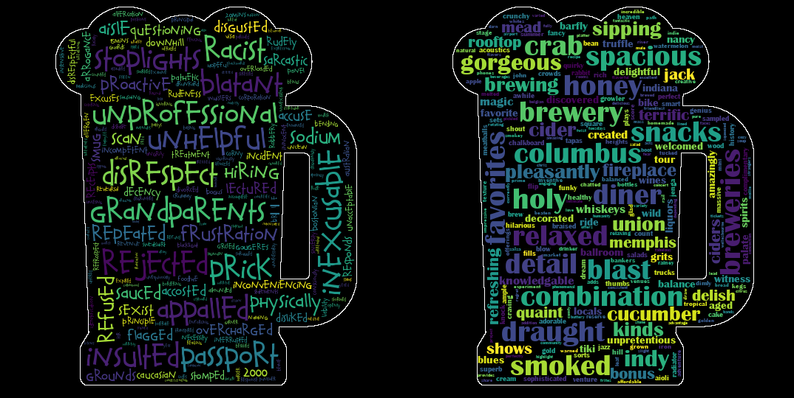

## An Unexpected Pivot

I never thought I would end up in data science. I hadn't even heard of data science until I stumbled across a bootcamp opportunity from my department's mailing list during my last year of graduate school. I took a look and it sounded interesting but best of all, it was free. So why the hell not - the only opportunity cost was my time.

## The Application Process

The application process took me ~60 hours to complete and was reasonably fun. There were two parts: 
1. A test-like portion that required analyzing a 10GB taxi dataset and 
2. An open-ended portion that required coming up with a data science project and pitching it. 

At the time, I considered myself lucky not because I only knew MATLAB which is awful at handling big data - but because I was armed with an i7 and 64GB of RAM. I ended up brute-forcing my way through the test portion over a weekend. However, the test portion was clearly a simple bar - completing it was good but wouldn't necessarily set you apart from other candidates. On top of that, the test portion was technically optional. So it became quite obvious that the differentiating factor would be the open-ended section.

The open-ended part took a significant amount of time, and I spent hours at the beginning going through ideas given my limited skillset of Matlab, a tiny bit of C++ and even less Java. I looked online at what makes a data science project good and tried to figure out how I could make my project stand out. For some strange reason, I had previously tried some browser automation with Selenium to grab Glassdoor jobs so I thought something with webscraping was appropriate. I ended up building a scraper for Yelp reviews and doing some word analytics on the resulting reviews.

And then I had to pitch my project. Since candidates were required to upload their pitch videos onto Youtube, I did my research to find some examples. I listened to a few pitches and after about five of them concluded that they were **boring AF**. All of them simply described what they did. Many started with "My project is about...", some went too technical and none of them left any lasting impacts. I'm not an expert in elevator pitches, but pitches should be captivating and persuasive - which is how I tried to build mine. So while this is an extremely small sample size of one, it must have worked to some degree because I ended up getting accepted. 

In case anyone is curious in watching my pitch you can find it [here](https://youtu.be/QEeGGuKTEwA)

## Epilogue

Looking back at some of the work I put into the application, it's interesting to see how far things have progressed. It's amazing how a little bit of coding, finding some cool open source package, and knowledge about visualizations could drastically change things. This was one of the visualizations I used in 2015 to apply for the fellowship. I probably spent a few hours putting this together in MATLAB from scratch. 

Cut to today, I would take a much different strategy to building this. Since word clouds better represent textual data, I'll look for packages that build them for me based on text-frequency dictionaries. Then I'd figure out to customize the shape of the cloud as well as the font face based on some examples in documentation. And with that, this is what you can together with [wordcloud](https://github.com/amueller/word_cloud) in under half an hour. 

#### Left: One Star Reviews, Right: Five Star Reviews

{: .full}
