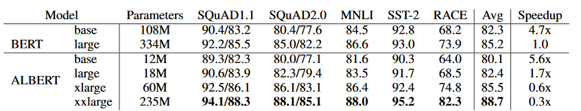
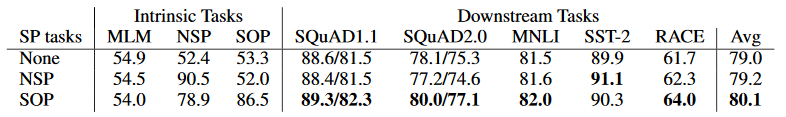

## Prologue

In an effort keep up more with advances in NLP, I've committed to reading more academic papers. ICLR 2020 presented a fresh opportunity at a multitude of papers to review. And as papers from Google are generally a good choice to read, I've chosen ALBERT for this post.

## ALBERT

This research came from a collaboration between Google Research and Toyota Institute of Technology. There were 3 primary propositions that this paper explored:

1. Reducing the vocabulary embedding size
2. Cross-transformer weights sharing 
3. Redefining the Next Sentence Prediction (NSP) task

As the first two items focused on reducing the number of parameters required to train a SOTA model as compared to BERT, this model was named or "A Lite BERT" or "ALBERT".

## Reducing the Vocabulary Embedding Size

As the vocabulary (V) embedding size (E) is directly tied to the transformer hidden size (H), increasing the transformer size typically means increasing the embedding matrix significantly. As these weights are sparsely updated during training, decoupling the two pieces could help reduce the number of parameters to learn. This is achieved (as far as I can tell) by having two layers instead of one:

* `BERT: V x H` (where E = H)
* `ALBERT: [V x E] -> [E x H]` (where E < H)

The size of E was empirically established by testing different embedding sizes (64, 128, 256, 768). If weights were shared across transformers, an embedding size of 128 yielded minor (< 1%) improvements over embedding sizes.

## Cross-Transformer Weights Sharing

Different parts of the transformer module can share weights - the self-attention portion, the feed-forward portion, or both. This can also be compared to not sharing any weights. Results showed that sharing just the self-attention portion yielded approximately similar results to not sharing any weights at all. The paper shows that sharing weights makes outputs across layers much smoother - suggesting a more stable model and potentially that if a transfer were lopped off, the model would still perform reasonably well.

However, sharing weights comes with a cost. At the same number of layers and hidden size (but with smaller embedding size), an ALBERT model that shares weights performs worse thn a BERT model that does not share any weights.  The BERT-large model has 334M parameters and takes 34 hours to go execute 400k training steps (0.3sec/step). The ALBERT-xxlarge model has 235M parameters, but takes 32 hours to execute 125k training steps (0.9sec/step). While the ALBERT-xxlarge model performs slightly better than BERT-large, training ALBERT is significantly slower likely due to the need to sync weights across TPU instances.



## Redefining the NSP Task

This part of the paper was to me the most important part of the paper. Originally, the Next Sentence Prediction (NSP) task as defined by BERT was to predict whether two sentences appeared next to each other. 
* **Positive examples** were sampled by obtaining two sentences that followed each other. ie:  

```
1. A long time ago, in a galaxy far, far away it is a period 
   of civil war.
2. Rebel spaceships, striking from a hidden base, have won 
   their first victory against the evil Galactic Empire.  
```  

* **Negative examples** were sampled by obtaining one sentence from a document and another sentence from a separate document. ie:

```
1. A long time ago, in a galaxy far, far away it is a period 
   of civil war.
2. Luke Skywalker has returned to his home planet of Tatooine 
   in an attempt to rescue his friend Han Solo.
```

This method of sampling negative examples makes the task closer to topic prediction and is consequently a significantly easier task.

In order to force the model to learn about "what the next sentence is", negative examples are created by swapping the order of the two consecutive sentences. This forces the model focus learning on sentence coherence. ie:
```
1. Rebel spaceships, striking from a hidden base, have won 
   their first victory against the evil Galactic Empire. 
2. A long time ago, in a galaxy far, far away it is a period 
   of civil war.
```
This method, termed "Sentence Order Prediction" (SOP) is clearly shown to be a superior task for understanding language - models trained using with NSP performed poorly on SOP tasks, but models trained with SOP performed reasonably well on NSP tasks.


### Additional

While only given a small mention, the paper mentioned that removing dropout after 1M steps significantly increased model performance on downstream tasks, opening the door for questions as to whether dropout should be removed after a point during training. However, it is noted that since ALBERT shares weights across layers, it has a level of self-regularization and that this effect may not be seen across other MLMs.

### Conclusions

With all the above mentioned factors, ALBERT did reach the top of the GLUE leaderboard. However, the authors noted that there still are additional semi-supervised tasks in addition to SOP that may improve performance.