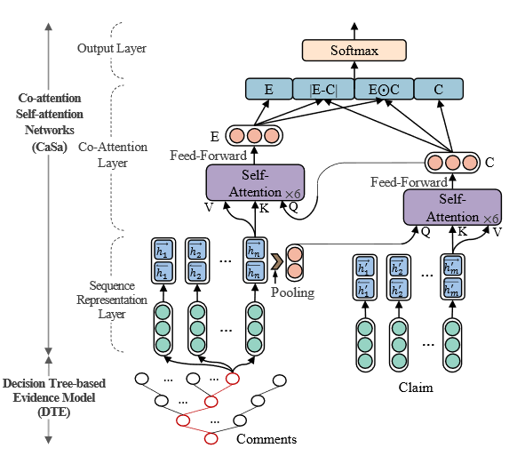

## DTCA - Decision Tree-based Co-attention Networks for Explainable Claim Verification

Link: [https://arxiv.org/pdf/2004.13455.pdf](https://arxiv.org/pdf/2004.13455.pdf)

> Research indicates that during the US presidential election (2016), fake news accounts for nearly 6% of all news consumption, where 1% of users are ex-posed to 80% of fake news, and 0.1% of users areresponsible for sharing 80% of fake news

The rise of social media has brought with it the challenge of claim verification. Current models can help determine whether a claim is `True` or `False`/`Unverified`, but cannot explain why. To increase model explainability, two different models were combined together:
1. A decision tree that parses through comments to extract the "best" comments by rating each comment on its:  
  * similarity to the claim at hand  
  * user credibilit (based on metadata, ie # of followers)  
  * comment credibility (based on metadata, ie # of favorites)  

2. The claim and pruned comments are tokenized, fed through BERT, a BiLSTM, and finally through transformers. In the transformer module, the query for the claim comes from the comments while the query for the comments comes from the claim.

This model was trained on RumousEval and PHEME, two datasets containing both claims and the respective comments from twitter, reddit, and news. Its performance was compared across a wide variety of models, from SVM to a Bayesian-DL model.

Results showed that this model achieved state-of-the-art performance. In general, models with semantic interaction between the claims and comments achieved ~5-10% higher performance than those that didn't. However, DTCA is the only DL model which prunes the comment tree to encode only relevant/high quality comments, reducing the amount of noise to the model. A degree of interpretability is also achieved by looking at which parts the comments sequence contained more attention/weights.

### Epilogue

This post was inspired by [shortscience](https://www.shortscience.org/), a site for an accessible `tl;dr` of academic publications. 