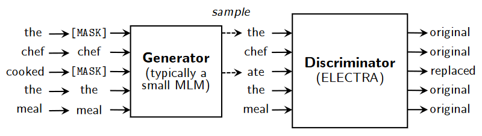

## Electra - Pre-training Text Encoders as Discriminators Rather Than Generators

Link: [https://openreview.net/pdf?id=r1xMH1BtvB](https://openreview.net/pdf?id=r1xMH1BtvB)

> ...we propose *replaced token detection*, a pre-training task in which the model learns to distinguish real input tokens from plausible but synthetically generated replacements.

For most masked language models (MLM), text encoders are pre-trained by randomly masking ~15% of the words in a sequence and seeing if the model can predict which word correctly fills in the blanks. Electra changes this by having a **generator** MLM that chooses seemingly plausible words to fill in the blank, and then seeing if a **discriminator** MLM can distinguish whether the words it receives are the original or have been replaced.

Token/positional embeddings are shared between the discriminator and generator. The generator presumably learns more about tokens as it needs to choose a reasonable word to fill in the blank from the entire corpus as opposed to the discriminator, which only considers the tokens that it's been provided. A smaller discriminator size relative to the generator size is used, likely because having a generator that is too good makes it difficult for the discriminator to learn properly.

Overall, Electra reaches better results in significantly fewer training steps and with less computational power when compared to BERT. These gains are because Electra learns from every token it is provided as it must predict whether or not each token has been replaced. In contrast, BERT only learns from trying to predict which word fills in the blank on the 15% of data that has been masked. This makes each BERT training step significantly less informative.

### Personal Thoughts

The most intriguing part is where the paper mentions that having a generator that is "too good" makes it difficult for the discriminator to learn properly. If the disciminator is trained via reinforcement learning or adversarially (ie, if the discriminator can figure out whether a token has been replaced, the generator needs to do better) results are also worse. The rationale for why a generator that is smart enough to fool a disciminator leads to worse results might be because the generator can find plausible and/or realistic replacements. As an example:

| `Original `| `Masked   `| `Generated     ` | `Label    `|
|------------|------------|------------------|------------|
| `The     ` | `\[MASK\] `| `A             ` | `replaced `|
| `chef    ` | `chef     `| `chef          ` | `original `|
| `cooked  ` | `\[MASK\] `| `prepared      ` | `replaced `|
| `the     ` | `the      `| `the           ` | `original `|
| `meal    ` | `meal     `| `meal          ` | `original `|

This sentence, despite having replaced tokens, still makes sense and could be a valid replacement. Having a model that can discriminate between original/replaced tokens of sentences like this may not lead to text-encoders that understand language. As such, there might be a sweet spot where the text generated is good enough that the discriminator can still learn, but not so good that it isn't actually learning about language anymore.

